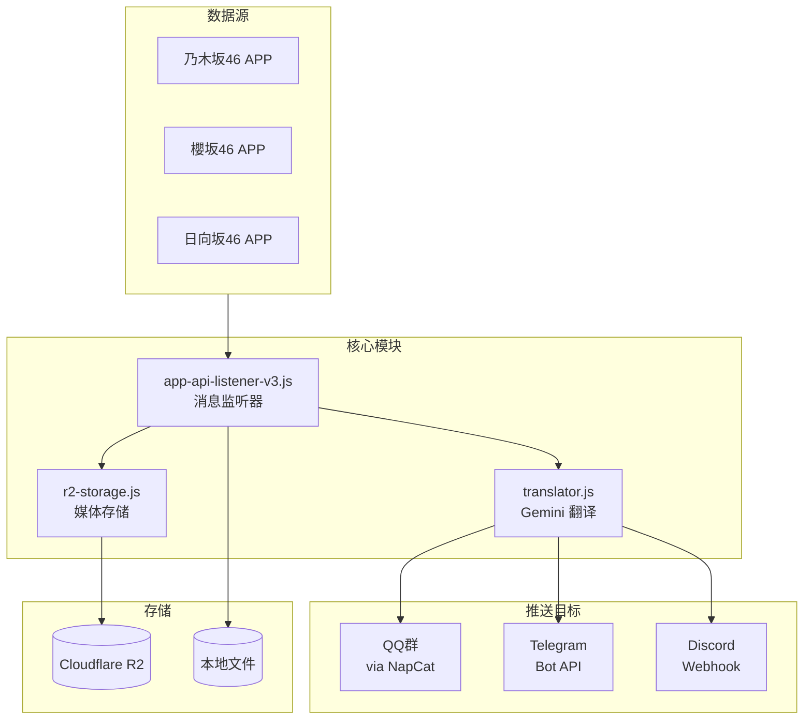

# 坂道46消息推送系统

自动抓取坂道46成员的 APP 消息，翻译后推送到 QQ群/Telegram/Discord。

## 系统架构



## 目录结构

```
MSG推送/
├── src/                          # 核心代码
│   ├── app-api-listener-v3.js    # 主程序：消息监听 + 推送
│   ├── push-config.js            # 推送配置（成员规则、API密钥）
│   ├── translator.js             # Gemini 翻译模块
│   ├── r2-storage.js             # Cloudflare R2 媒体上传
│   ├── group-chat-handler.js     # QQ群 @翻译 处理
│   ├── ocr.js                    # 图片 OCR
│   └── config.js                 # 基础配置
├── cloudflare-worker/            # Cloudflare Worker
│   └── r2-media-proxy.js         # R2 媒体代理（短链接）
├── scripts/                      # 调试脚本
├── data/                         # 运行时数据
└── 服务器/                       # 部署文档
```

## 核心功能

### 1. 消息监听
- 每 15 秒轮询三个 APP 的消息 API
- 使用 Google OAuth 认证
- 自动刷新 Token（每 30 分钟）

### 2. 翻译
- 使用 Gemini API 翻译日文消息
- 支持重试和失败报警
- 翻译 Prompt 可自定义

### 3. 多平台推送

| 平台 | 方式 | 特点 |
|-----|------|------|
| QQ群 | NapCat OneBot API | 支持图片/视频/语音 |
| Telegram | Bot API | 支持富文本格式 |
| Discord | Webhook + Embed | 支持 R2 媒体嵌入 |

### 4. 媒体处理
- 图片/视频/语音下载到服务器
- 上传到 Cloudflare R2（Discord 使用）
- 文件命名：`成员名_YYYYMMDD_HH-mm-ss.ext`

## 配置说明

### push-config.js

```javascript
module.exports = {
    // NapCat API 地址
    lagrangeApi: 'http://127.0.0.1:3000',
    
    // Telegram Bot
    telegram: {
        botToken: 'xxx',
        enabled: true,
    },
    
    // Cloudflare R2
    r2: {
        enabled: true,
        bucket: 'xxx',
        publicUrl: 'https://msgmedia.xxx.workers.dev',
    },
    
    // 成员推送规则
    memberPushRules: {
        '成员 名字': {
            qqGroups: ['群号1', '群号2'],
            noTranslateGroups: ['群号2'],  // 只发原文
            telegramChats: ['chat_id'],
            discord: 'webhook_url',
            enabled: true,
        },
    },
};
```

### 环境变量 (.env)

```bash
# Google OAuth Token
NOGIZAKA_REFRESH_TOKEN=xxx
SAKURAZAKA_REFRESH_TOKEN=xxx
HINATAZAKA_REFRESH_TOKEN=xxx

# Gemini API
GEMINI_API_KEY=xxx
GEMINI_MODEL=gemini-2.5-pro
```

## 部署

### 依赖服务
- **NapCat**: QQ 机器人框架（Docker）
- **PM2**: 进程管理
- **Cloudflare R2**: 媒体存储

### 启动命令

```bash
# 安装依赖
npm install

# 启动服务
pm2 start src/main.js --name msg-pusher

# 查看日志
pm2 logs msg-pusher
```

## 特性

### 热加载
配置文件每 5 分钟自动重新加载，修改 `push-config.js` 后无需重启服务。

### 分群翻译控制
通过 `noTranslateGroups` 配置，指定特定群组只接收原文，不附带翻译。

### 媒体代理
Discord 媒体通过 Cloudflare Worker 代理，使用短链接：
```
https://msgmedia.xxx.workers.dev/成员名/文件名.jpg
```

## API 数据结构

### 成员（Group）对象字段

| 字段 | 类型 | 说明 |
|------|------|------|
| `id` | number | 成员唯一ID |
| `name` | string | 成员姓名 |
| `thumbnail` | string | 成员头像URL |
| `state` | string | 状态：`open`（活跃）/ `closed`（关闭） |
| `organization_id` | number | 所属组织ID |
| `priority` | number | 排序优先级 |
| `is_letter_destination` | boolean | 是否接收手紙 |
| `updated_at` | string | 最后更新时间 |
| `tags` | array | 标签列表 |
| `options` | object | 其他选项（分享链接等） |
| `subscription` | object | 订阅状态（`state: 'active'` 表示已订阅） |

### 消息（Message）对象字段

| 字段 | 类型 | 说明 |
|------|------|------|
| `id` | number | 消息ID |
| `text` | string | 消息文本内容 |
| `type` | string | 类型：`text`/`picture`/`video`/`voice` |
| `file` | string | 媒体文件URL（图片/视频/语音） |
| `published_at` | string | 发送时间 |

## 日志示例

```
🔍 [2026/01/02 20:30:15] 检查新消息...
   📬 大園 玲: 新消息: みなさん、こんばんは！
   🔄 翻译中...
   ✅ 翻译完成
   📥 媒体已下载: 大園 玲_20260102_11-30-00.jpg
   ✅ QQ群 768670254 推送成功
   ✅ Telegram -1003552370330 推送成功
   ✅ Discord Webhook 推送成功
```
